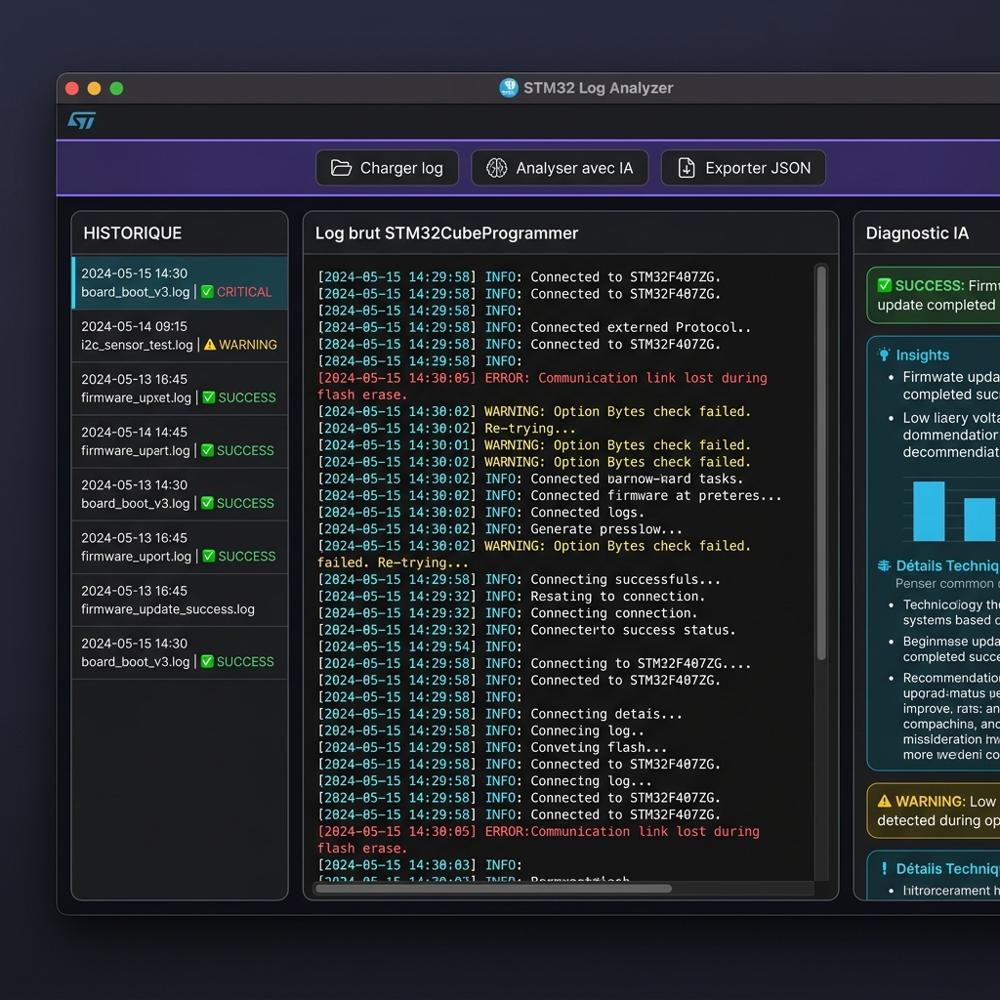

<div align="center">

# ⚡ STM32 Log Analyzer

### AI-Powered Diagnostic Tool for STM32CubeProgrammer Logs

[](https://www.python.org/)
[](https://doc.qt.io/qtforpython/)
[](https://groq.com/)
[](LICENSE)
[](https://www.microsoft.com/windows)
[](https://en.wikipedia.org/wiki/Model%E2%80%93view%E2%80%93controller)

**A professional desktop application that automatically loads, parses, and diagnoses STM32CubeProgrammer log files using Groq AI (Llama 3.1 8B), delivering instant diagnostic reports for embedded systems developers.**

</div>

---

## 📸 Preview

> *Dark-themed premium interface with 3-panel layout: History · Raw Logs · AI Diagnosis*



---

## ✨ Key Features

| Feature | Description |
|---------|-------------|
| 📁 **Instant Log Loading** | Import `.log` or `.txt` files generated by STM32CubeProgrammer |
| 🎨 **Premium Dark UI** | macOS-inspired frameless window with custom title bar |
| 🤖 **Real-time AI Diagnosis** | Powered by Groq's Llama 3.1 — explanations, fix steps, hardware checks |
| 📊 **Live Statistics** | Dynamic error/warning badges + STM32 board auto-detection |
| ⏳ **Analysis History** | Persistent left-panel history — instantly reload any past session |
| 💾 **JSON Export** | Structured JSON reports, auto-named with log name + timestamp |
| 🔍 **Syntax Highlighting** | Color-coded log viewer (timestamps in cyan, errors in red, warnings in amber) |
| ⚡ **Non-blocking Analysis** | Background threading — UI stays responsive during AI inference |

---

## 🏗️ Architecture (MVC)

The project follows a clean **Model-View-Controller** architecture for modularity and maintainability:

```
stm32-log-analyzer/
│
├── main.py                          # Application entry point
├── requirements.txt                 # Python dependencies
├── Lancer_Analyseur.bat             # One-click Windows launcher
├── .env.example                     # API key configuration template
│
├── app/
│   ├── models/
│   │   ├── ai_client.py             # 🤖 Groq API integration (Llama 3.1)
│   │   └── log_parser.py            # 🔍 STM32 log parser (errors/warnings/timestamps)
│   ├── controllers/
│   │   └── analysis_controller.py   # 🎛️ Pipeline orchestration (parse → AI → report)
│   ├── views/
│   │   └── main_window.py           # 🖥️ PySide6 UI (3-panel dark interface)
│   └── utils/
│       └── report_manager.py        # 💾 JSON report creation and storage
│
├── tests_logs/                      # Sample STM32 log files for testing
│   ├── mock_error.log               # Simulated RDP Level 1 protection error
│   ├── flash_protection_errors.log  # Simulated Flash write-protection errors
│   └── clignotement_led.log         # Successful LED blink firmware flash
│
└── output_reports/                  # Auto-generated JSON diagnostic reports
```

---

## 🔄 How It Works

```
┌─────────────────────────────────────────────────────────────────┐
│                        USER WORKFLOW                            │
│                                                                  │
│  .log file  ──►  STM32LogParser  ──►  AnalysisController       │
│                       │                       │                  │
│               Extract errors,          Send to Groq API         │
│               warnings, board          (Llama 3.1 8B)          │
│               name, timestamps                │                  │
│                                        AI Diagnosis             │
│                                               │                  │
│               ReportManager  ◄────────────────┘                 │
│                    │                                             │
│              Save JSON report                                    │
│                    │                                             │
│              MainWindow (PySide6) ──► Display result            │
└─────────────────────────────────────────────────────────────────┘
```

---

## 🚀 Getting Started

### Prerequisites

- **Python 3.10+** — [Download here](https://python.org)
- **Groq API Key** (free) — [Get yours at console.groq.com](https://console.groq.com/)

### 1. Clone the Repository

```bash
git clone https://github.com/YOUR_USERNAME/stm32-log-analyzer.git
cd stm32-log-analyzer
```

### 2. Install Dependencies

```bash
pip install -r requirements.txt
```

| Package | Version | Purpose |
|---------|---------|---------|
| `PySide6` | ≥ 6.5.0 | Qt6 GUI framework (windows, widgets, layouts) |
| `groq` | ≥ 0.4.0 | Official Python client for the Groq API |
| `python-dotenv` | ≥ 1.0.0 | Secure API key loading from `.env` |

### 3. Configure Your API Key

Copy the example environment file and add your key:

```bash
cp .env.example .env
```

Edit `.env`:

```env
GROQ_API_KEY=gsk_your_api_key_here
```

> 🔒 The `.env` file is listed in `.gitignore` — your API key will **never** be committed.

### 4. Launch the Application

**Option A — Windows one-click launcher:**
```
Double-click Lancer_Analyseur.bat
```

**Option B — Terminal:**
```bash
python main.py
```

---

## 🎮 Usage

1. Click **`📁 Charger log`** to load a `.log` or `.txt` file
2. Instantly view the **color-highlighted log content** with error/warning statistics
3. Click **`⚙️ Analyser avec IA`** to trigger the AI diagnostic pipeline
4. Read the **structured diagnosis**: type, summary, fix steps, hardware check
5. Click **`📥 Exporter JSON`** to open the saved JSON report
6. Use the **`⏳ Historique`** panel to reload any previous analysis session

---

## 🧪 Test with Sample Logs

The `tests_logs/` directory includes ready-to-use sample logs:

| File | Scenario |
|------|---------|
| `mock_error.log` | RDP Level 1 read protection active |
| `flash_protection_errors.log` | Flash write-protection blocking flash |
| `clignotement_led.log` | Successful firmware flash (no errors) |

---

## 🛠️ Tech Stack

<div align="center">

| Technology | Role |
|-----------|------|
| **Python 3.10+** | Core language |
| **PySide6 / Qt 6** | Cross-platform GUI framework |
| **Groq API** | Ultra-fast AI inference (Llama 3.1 8B) |
| **python-dotenv** | Secure environment variable management |
| **QThread / Signal-Slot** | Non-blocking background analysis |
| **JSON** | Structured report persistence |

</div>

---

## 📋 AI Diagnostic Format

The AI returns a structured diagnosis following strict rules:

```
TYPE: [SUCCÈS / CRITIQUE / AVERTISSEMENT] — [Short title]
RESUME: [Max 2-sentence summary]
SOLUTIONS:
  1. [Concrete action or "No action required"]
VÉRIFICATION MATÉRIELLE: [Oui / Non] — [Short reason]
```

Rules enforced:
- `"Download verified successfully"` → **SUCCÈS** (success, no action needed)
- `"Error:"` found → **CRITIQUE** (with fix steps)
- `"Warning:"` found → **AVERTISSEMENT**
- Hardware check **only** triggered for SWD/power/cable errors

---

## 📁 Project Structure Details

```
app/
├── models/
│   ├── ai_client.py          # AIClient class — Groq API wrapper
│   │                         # Model: llama-3.1-8b-instant
│   │                         # Strict system prompt for structured output
│   └── log_parser.py         # STM32LogParser class + LogEntry dataclass
│                              # Parses: timestamp, level (INFO/WARNING/ERROR), message
├── controllers/
│   └── analysis_controller.py# AnalysisController.run_full_analysis()
│                              # 4-step pipeline with progress callbacks
├── views/
│   └── main_window.py        # MainWindow (frameless QMainWindow)
│                              # TitleBar, StatCard, LogHighlighter, AnalysisWorker
└── utils/
    └── report_manager.py     # ReportManager.save_report()
                               # Auto-named JSON: {log_name}_{datetime}.json
```

---

## 🤝 Contributing

Contributions are welcome! Feel free to:

1. Fork the project
2. Create your feature branch: `git checkout -b feature/your-feature`
3. Commit your changes: `git commit -m 'feat: add some feature'`
4. Push to the branch: `git push origin feature/your-feature`
5. Open a Pull Request

---

## 📄 License

This project is licensed under the **MIT License** — see the [LICENSE](LICENSE) file for details.

---

## 👨‍💻 Author

> Built with ❤️ for the **embedded systems community**.  
> If this tool helped you, consider leaving a ⭐ on GitHub!

---

<div align="center">

**STM32 Log Analyzer** · Python · PySide6 · Groq AI · Llama 3.1

*Turning raw STM32 logs into actionable diagnostics — instantly.*

</div>
